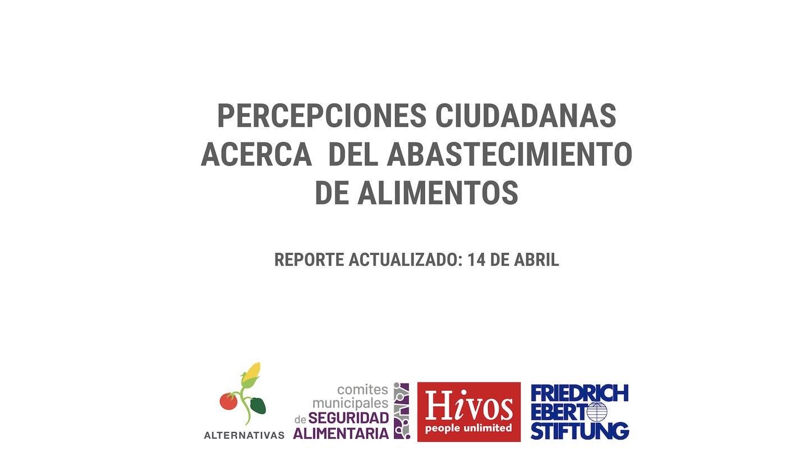
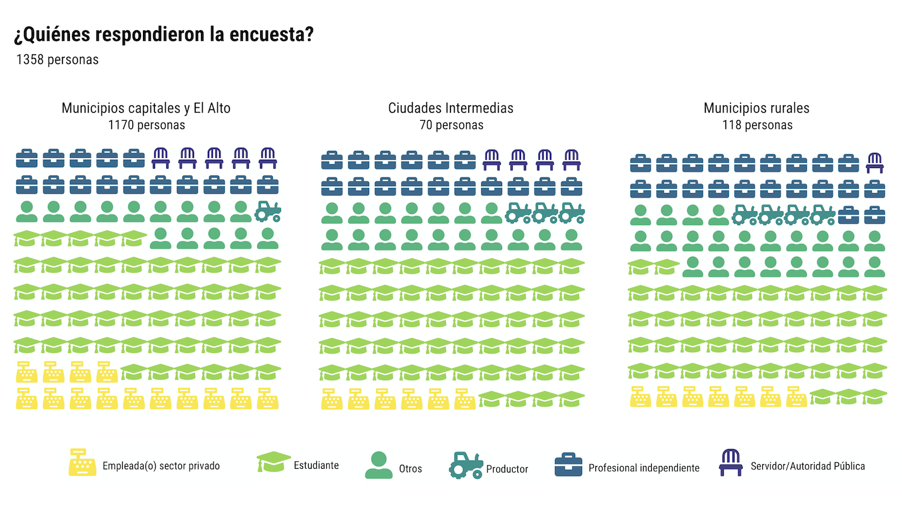
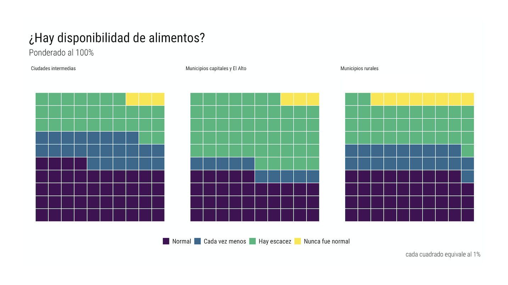
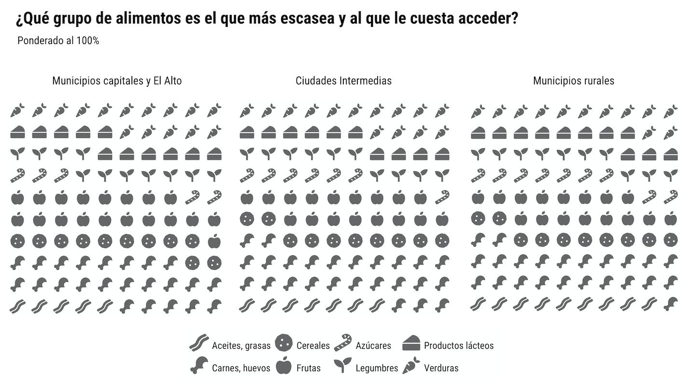
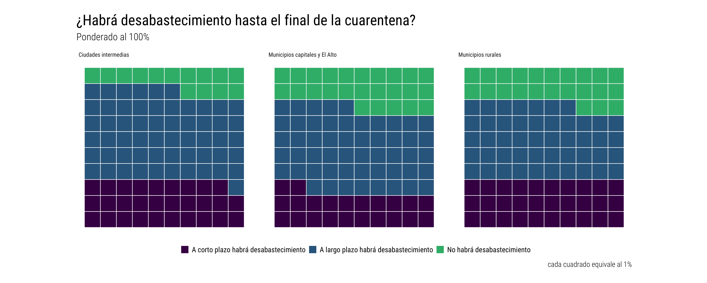
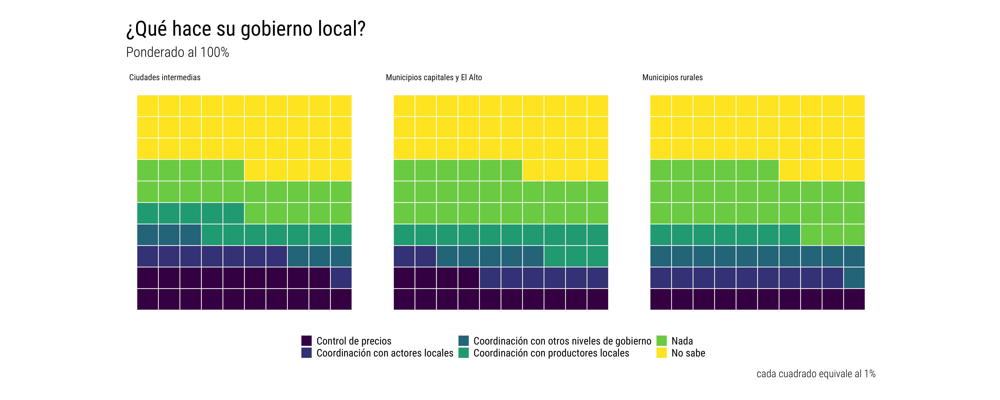

```{r setup, include=FALSE}
knitr::opts_chunk$set(echo = TRUE)
library(fontawesome)
```

Inicio
=====================================  



Motivación/Contactos
=====================================  
Row {.tabset .tabset-fade}
-------------------------------------

### Sobre el proyecto

<h4><center>**Percepciones Ciudadanas acerca del Abastecimiento en el marco del Estado de Emergencia Sanitaria COVID-19:**<br>
**Una herramienta digital para fortalecer acciones locales**<br></center></h4>


<br>
<br>

Las medidas preventivas adoptadas han interrumpido el cotidiano vivir de la ciudadanía; entre ellos, el flujo normal de bienes y servicios. Ciertamente, una de las garantías que se deben resguardar en el marco de situaciones de contingencia es el abastecimiento de alimentos debido a que estos se constituyen en una necesidad básica para la vida.


Esta herramienta se constituye en una herramienta que permite recoger y registrar percepciones ciudadanas de diferentes municipios del país, en torno al estado de abastecimiento de alimentos y su capacidad de llegar a puntos de comercialización de alimentos (formales o informales). 


El levantamiento de datos se realiza mediante entrevistas telefónicas, personalizadas, a habitantes en diferentes regiones del país. La información recogida pasa a alimentar una base de datos, misma que está vinculada con herramientas digitales que permiten visualizar la información recogida.


Este trabajo está centrado en visualizar y canalizar las percepciones de la ciudadanía hacia tomadores de decisión y generar información para diseñar estrategias en torno al abastecimiento en el contexto de un estado de emergencia para el cual no estaba preparado el país. Ciertamente es de suma urgencia conocer las necesidades de la ciudadanía desde la experiencia cotidiana que se vive en diferentes regiones y territorios del país.

### Contactos

<br>
<center>**Fundación Alternativas**

Calle Lisimaco Gutierrez No. 490

Edificio De Luna, Oficina 5B

Sopocachi / La Paz, Bolivia

[www.alternativascc.org](http://alternativascc.org/)  

<br>
**Persona de contacto:** 


Viviana Zamora

+591 76757767

vzamora@alternativascc.org 

<br>
**Síguenos en redes:** 

<h2><center>[`r fa("facebook", fill = "steelblue")`](https://www.facebook.com/Alternativascc/)</center></h2>
<h2><center>[`r fa("twitter", fill = "#1DA1F2")`](https://www.twitter.com/alternativascc)</center></h2>
<h2><center>[`r fa("instagram", fill = "#e95950")`](https://www.instagram.com/alternativascc)</center></h2>


Reporte actualizado: 13 de Abril
=====================================  

Row {.tabset .tabset-fade}
-------------------------------------
### Encuestados


### Cobertura geográfica
<iframe frameBorder="0" src="img/semana_3/donde.html" width="100%" height="100%" allowtransparency="true"></iframe>

### Fuentes de abastecimiento
<iframe frameBorder="0" src="img/semana_3/abastecimiento.html" width="100%" height="100%" allowtransparency="true"></iframe>


### Disponibilidad de alimentos


### Dificultades para abastecerse
<iframe frameBorder="0" src="img/semana_3/dificultades.html" width="100%" height="100%" allowtransparency="true"></iframe>

### Escasez de productos


### Abastecimiento hasta final de cuarentena 


### Acciones de su gobierno local


Reportes pasados y comparados
=====================================  

Row {.tabset .tabset-fade}
-------------------------------------
### Reportes pasados

- [Reporte 1: 27 de Marzo](https://drive.google.com/open?id=18K6zQNgA8Ry8ZM8oL-tdLAprsnVeR-zU)
- [Reporte 2: 6 de Abril](https://drive.google.com/open?id=10wUxKSZ6T0QrPepFwEedYin6oh211MVP)

### Comparación en el tiempo
<iframe frameBorder="0" src="comparador_1.html" width="100%" height="100%" allowtransparency="true"></iframe>


Llena nuestra encuesta
=====================================  

<center><h2>Gracias por ayudarnos con la encuesta!

El ícono te llevará a ella</h2></center>

<h1><center>[`r fa("poll", fill = "black")`](https://forms.gle/j5k6rNYrtXPzCQfL9)</center></h1>

